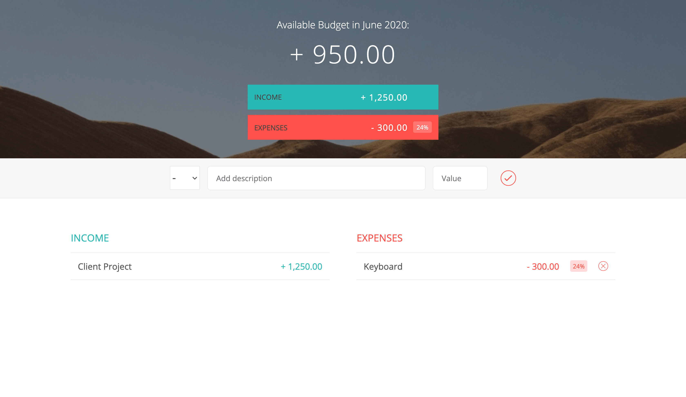

# About Budgety

Budgety is the Web Application written in Vanilla JavaScript for managing your incomes and expenses
I was making this app through the JavaScript course by Jonas Schmedtmann

## License

The Budgety is open-sourced software licensed under the [MIT license](https://opensource.org/licenses/MIT).
